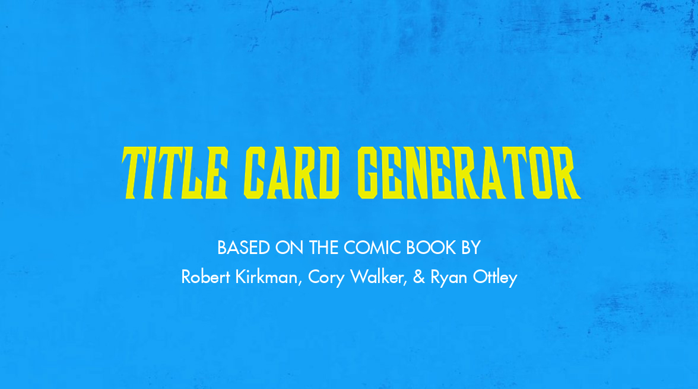

# \[Title Card\] Title Card Generator



A Python script to generate \[Title Card\] title cards with customizable text, colors, and effects. Perfect for creating title screens, thumbnails, or promotional images.

## Features

- Customizable title text with automatic font size adjustment
- Optional subtitles with credits
- Multiple background options
- Text outline and color customization
- Special effects (glitch, distort, shadow)
- Perspective transformation for the main title
- Lossless PNG output

## Requirements

- Python 3.x
- Pillow (PIL)
- NumPy

## Installation

### Option 1: Using Precompiled Binary (Recommended)

1. Visit the [Releases](https://github.com/glitchmill/insoluble-py/releases) section of the repository.
2. Download the appropriate binary for your system.
3. Follow any additional instructions provided in the release notes (if applicable).

### Option 2: Using Source (Requires Compilation)

If you prefer to build the binary from source or want to use the script directly, follow these steps:

1. Clone this repository:
   ```bash
   git clone https://github.com/glitchmill/insoluble-py.git
   cd insoluble-py
   ```

2. Install the required packages:
   ```bash
   pip install -r requirements.txt
   ```

3. Compile the binary by running the following script:
   ```bash
   pyinstaller insoluble.spec
   ```

This will compile the binary, and you can then use it just like the precompiled version.

## Usage

<video width="640" height="360" controls>
  <source src="assets/demo.mp4" type="video/mp4">
  Your browser does not support the video tag.
</video>

Basic usage:
```bash
./insoluble "YOUR TITLE"
```

This will generate a title card with your text and save it as `your-title.png`.

### Options

- `--subtitle TEXT`: Set the main subtitle (default: "Robert Kirkman, Cory Walker, & Ryan Ottley")
- `--small-subtitle TEXT`: Set the small subtitle (default: "BASED ON THE COMIC BOOK BY")
- `--title-font-size SIZE`: Set the initial title font size (default: 300)
- `--subtitle-font-size SIZE`: Set the subtitle font size (default: 30)
- `--color HEX`: Set the text color in hex format (default: "#ebed00")
- `--outline-color HEX`: Set the outline color in hex format (default: "#000000")
- `--outline SIZE`: Set the outline size in pixels (default: 0)
- `--background FILE`: Set the background image (must be in assets/background/)
- `--effect EFFECT`: Apply a special effect (choices: glitch, distort, shadow)
- `--output FILE`: Specify a custom output filename
- `--show-credits`: Show subtitle credits

### Examples

1. Basic title card:
```bash
./insoluble "Invisible"
```

2. Title card with subtitles and custom colors:
```bash
./insoluble "The Walking Dead" --show-credits --color "#ff0000" --outline 5
```

3. Title card with special effect:
```bash
./insoluble "Invincible" --effect glitch --background red.jpg
```

## File Structure

```
.
├── app.py                 # Main script
├── assets/
│   ├── background/        # Background images
│   └── fonts/            # Font files
└── requirements.txt       # Python dependencies
```

## License

This app is Licensed under the Unlicense.
[LICENSE](LICENSE)
